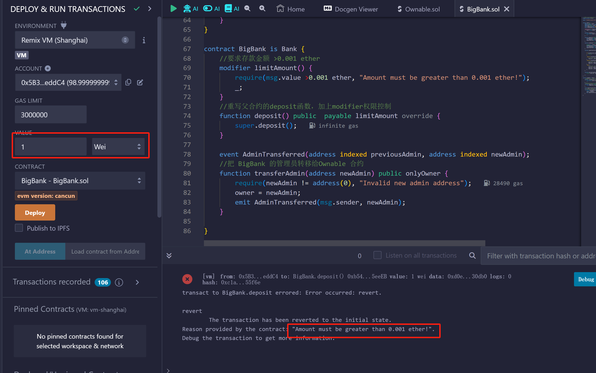
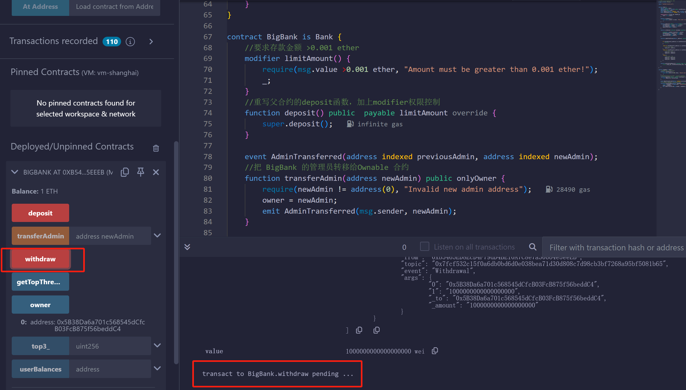
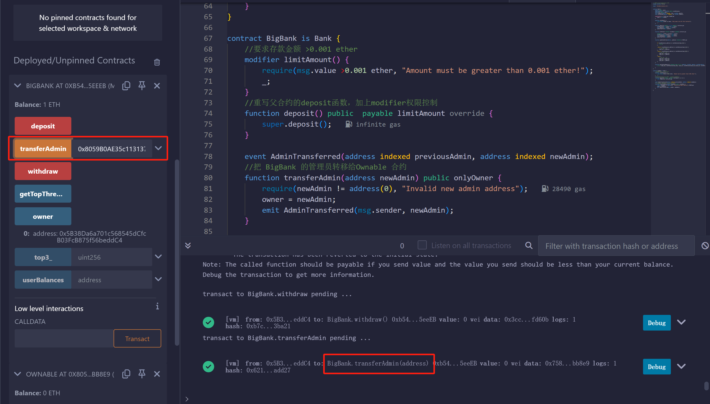
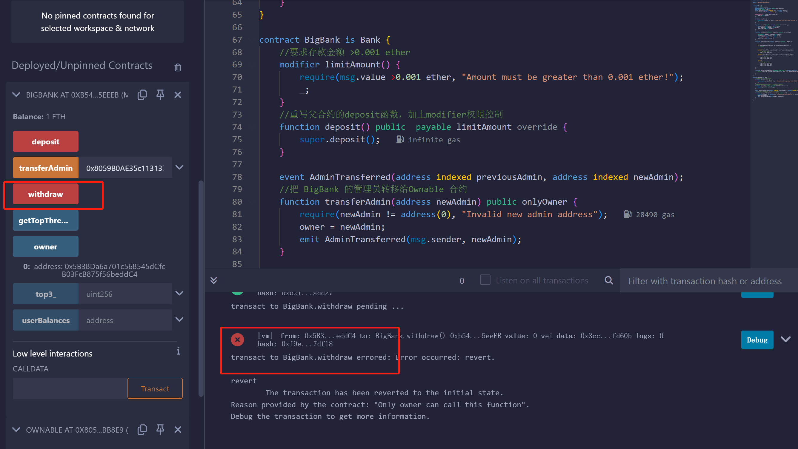
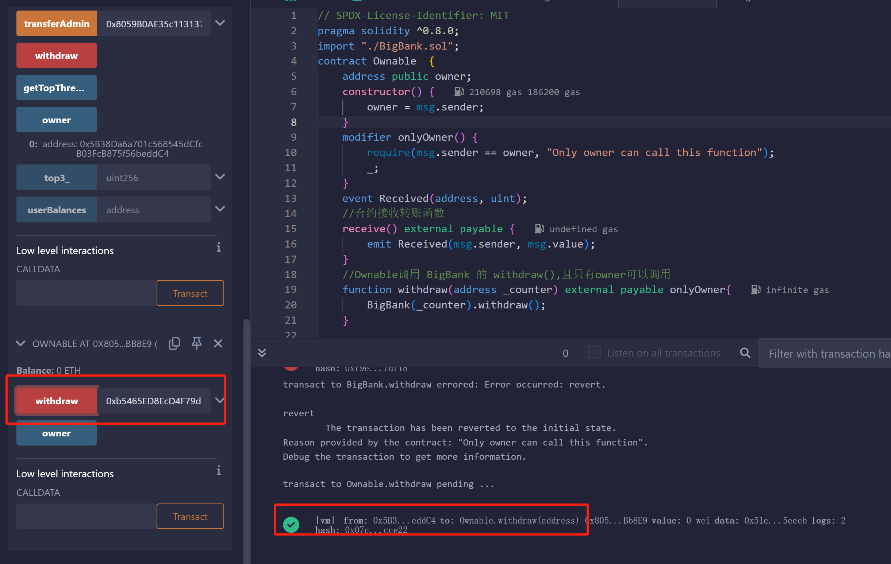
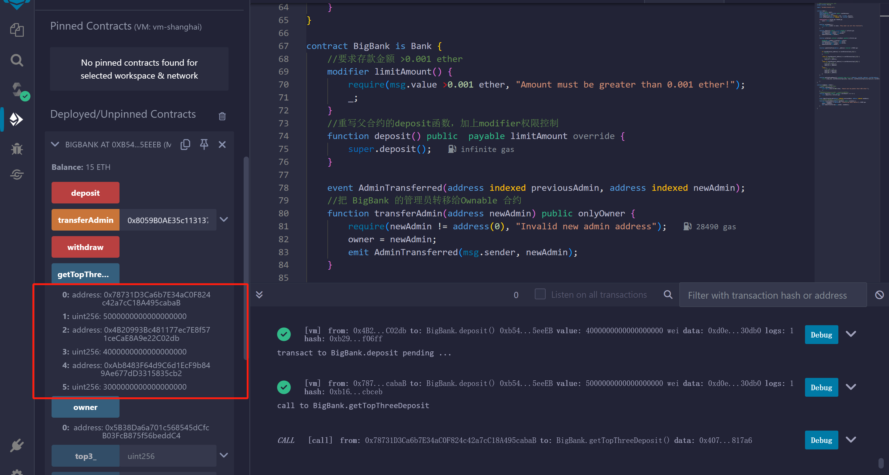

## 用 Solidity 编写 BigBank 智能合约

编写一个 BigBank 合约， 它继承自该挑战 的 Bank 合约，并实现功能：
1.要求存款金额 >0.001 ether（用modifier权限控制）
2.BigBank 合约支持转移管理员
3.同时编写一个 Ownable 合约，把 BigBank 的管理员转移给Ownable 合约， 实现只有Ownable 可以调用 BigBank 的 withdraw().
4.编写 withdraw() 方法，仅管理员可以通过该方法提取资金。
5.用数组记录存款金额的前 3 名用户

EOA：0x5B38Da6a701c568545dCfcB03FcB875f56beddC4部署合约，存钱1Wei报错，因为要求存款金额 >0.001 ether

BigBank合约支持转移管理员：
没有转移情况下，BigBank合约withdraw函数可以正常使用

BigBank的管理员转移给Ownable合约

此时BigBank无法执行withdraw函数

Ownable合约可以成功调用withdraw函数

BigBank合约用数组记录存款金额的前 3 名用户

