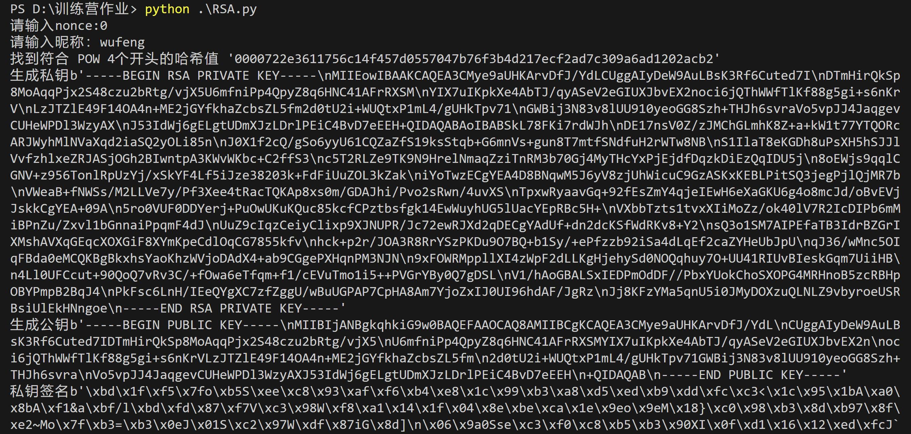
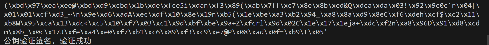

## 实践 POW 与非对称加密

实践 POW， 编写程序用自己的昵称 + nonce，不断进行 sha256 Hash 运算：
直到满足 4 个 0 开头的哈希值，打印出花费的时间。
再次运算直到满足 5 个 0 开头的哈希值，打印出花费的时间。

## 实践非对称加密 RSA

先生成一个公私钥对
用私钥对符合 POW 4个开头的哈希值的 “昵称 + nonce” 进行私钥签名
用公钥验证

