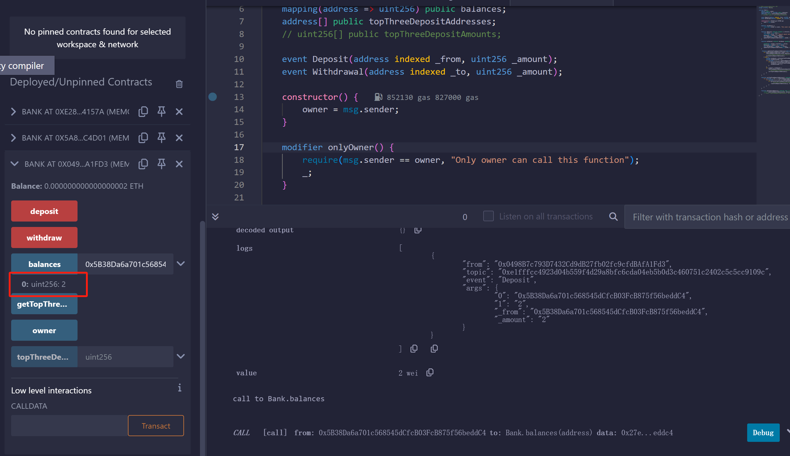
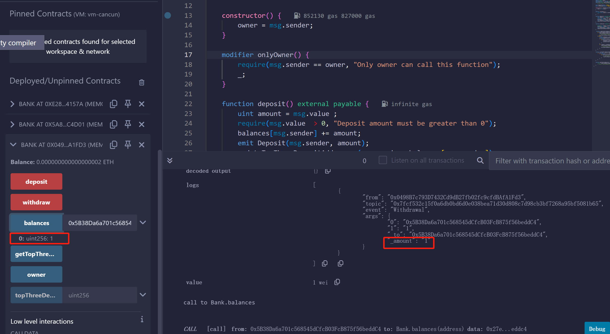
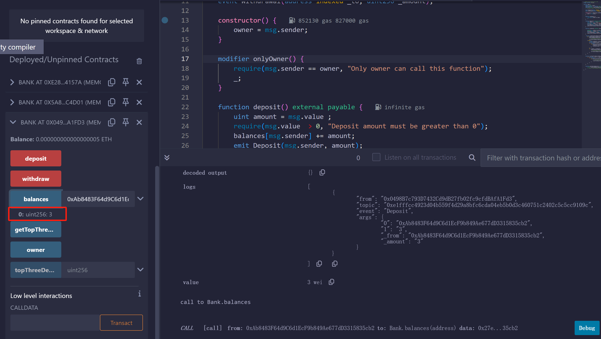
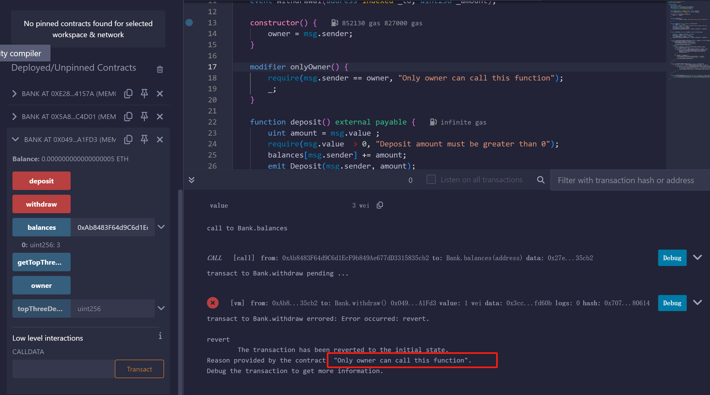
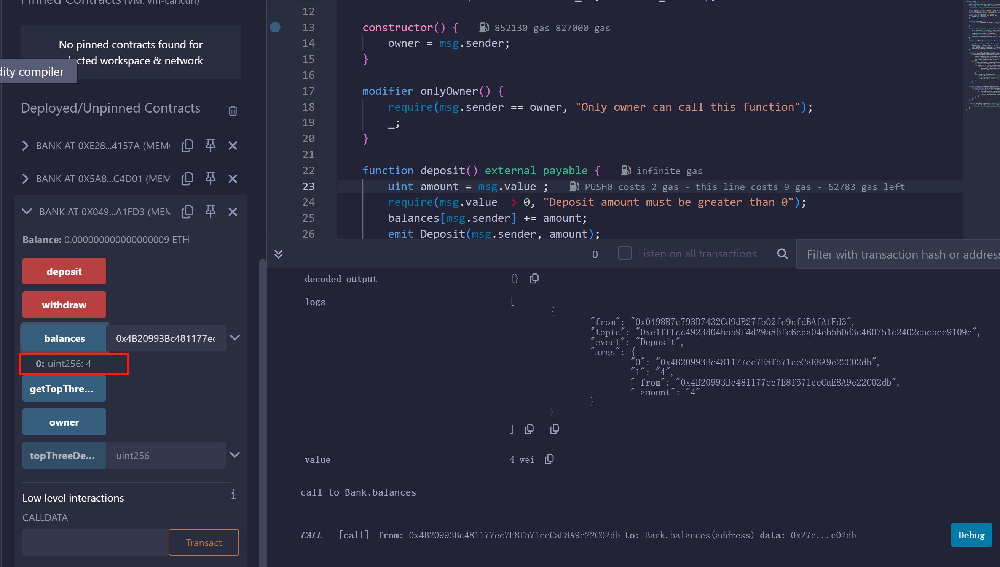
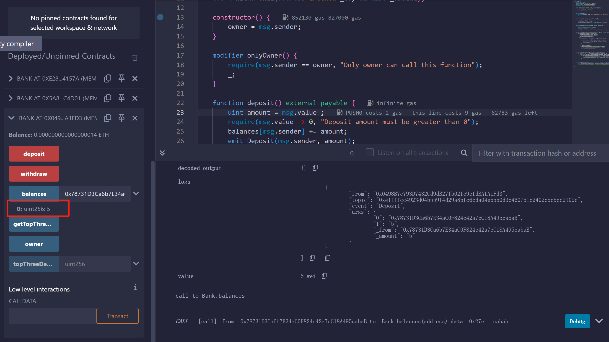
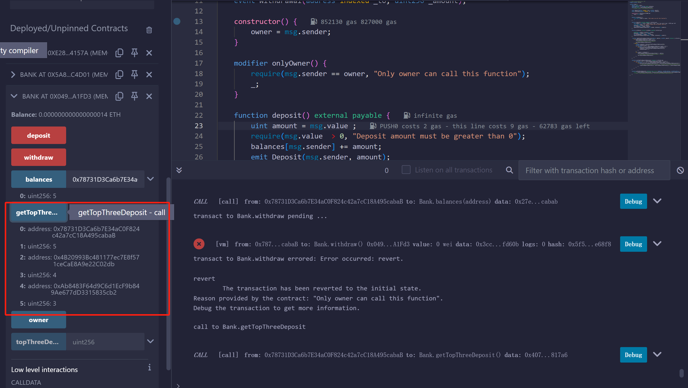

## 用 Solidity 编写 Bank 智能合约

编写一个 Bank 合约，实现功能：
1.可以通过 Metamask 等钱包直接给 Bank 合约地址存款
2.在 Bank 合约你记录每个地址的存款金额
3.编写 withdraw() 方法，仅管理员可以通过该方法提取资金。
4.用数组记录存款金额的前 3 名用户

* [代码](Bank.sol)

EOA：0x5B38Da6a701c568545dCfcB03FcB875f56beddC4部署合约，存钱2

EOA：0x5B38Da6a701c568545dCfcB03FcB875f56beddC4取钱1

EOA：0xAb8483F64d9C6d1EcF9b849Ae677dD3315835cb2存钱3

EOA：0xAb8483F64d9C6d1EcF9b849Ae677dD3315835cb2取钱失败，因为不是管理员

EOA：0x4B20993Bc481177ec7E8f571ceCaE8A9e22C02db存钱4

EOA：0x78731D3Ca6b7E34aC0F824c42a7cC18A495cabaB存钱5

获取前3金额用户以及其金额

