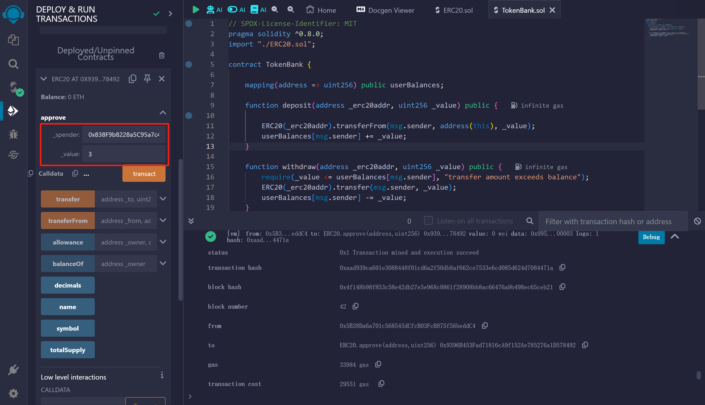
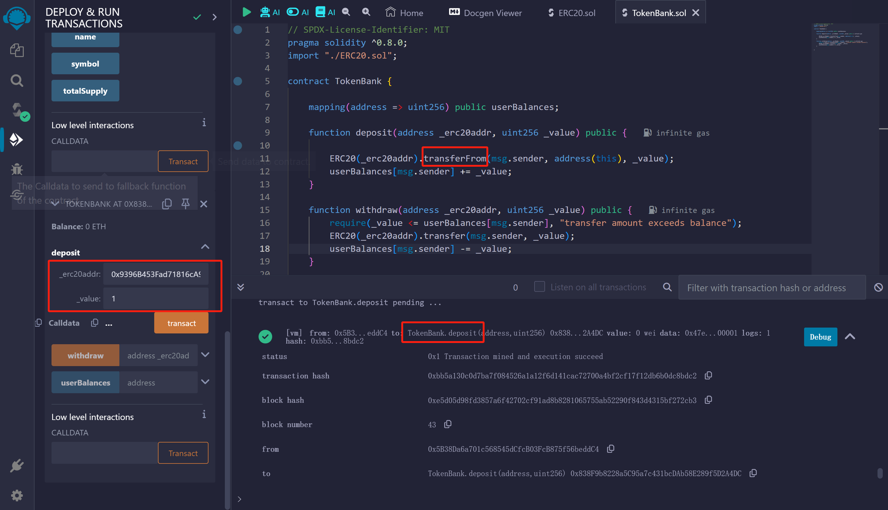
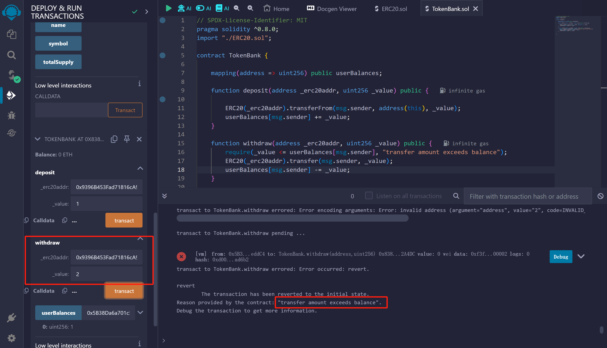
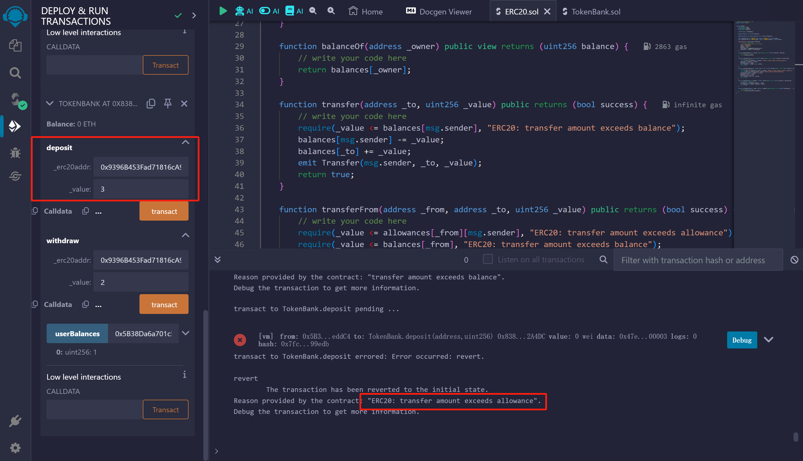
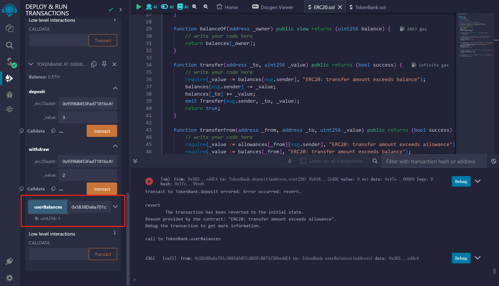

## 用 Solidity 编写 TokenBank

编写一个 TokenBank 合约，可以将自己的 Token 存入到 TokenBank，和从 TokenBank 取出。TokenBank 有两个方法：
1.deposit() : 需要记录每个地址的存入数量；
2.withdraw（）: 用户可以提取自己的之前存入的 token。

* [ERC20.sol代码](ERC20.sol)
* [TokenBank.sol代码](TokenBank.sol)

调用ERC20合约approve函数，授权TokenBank合约，额度为3

调用TokenBank合约deposit函数存款1，函数里面引用ERC20合约的transferFrom函数

用户取钱2，报错transfer amount exceeds balance，因为余额只有1。withdraw函数引用ERC20合约的transfer函数

用户存钱3，报错ERC20: transfer amount exceeds allowance，因为授权额度只有3，刚才已经存钱了1，授权额度只剩2

userBalances函数可以查看用户余额

